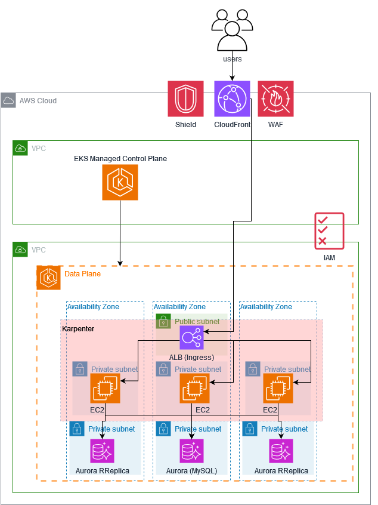

# AB3-App Project

This project contains the infrastructure and application manifests for the AB3 application deployment on AWS EKS.

## Problem statement

“AnyCompany” has been around for many years and has grown both organically and through acquisition and now operates in almost every industry.
AnyCompany has a monolithic and worldwide e-commerce web application and is interested in exploring a microservices approach on AWS cloud, particularly leveraging the use of containers.Their current setup consists of:
- A monolithic application (web servers to serve content) running on premises
- Data stored in a MySQL database
- Custom user management solution to handle users (no third-party solutions are used)
- Cloudflare infrastructure for CDN and Web Application Firewall (WAF) implementation, handling content delivery and security at the edge

They have some challenges with their current architecture:The monolithic structure makes it difficult to scale and maintain different components independently. Their operations team spends significant time managing servers and applying patches. During peak loads, they struggle with manual scaling interventions. Additionally, they have high latency for global users.
Requirements:
- Present a cloud architecture on AWS using a microservices approach with containers
- Minimize server management and maintenance overhead and implement automatic scaling for containers during peak loads
- Ensure worldwide low-latency customer experience
- Integrate AWS security services for protection against DDoS attacks and other security threats

## Proposed solution

A production-ready AWS EKS platform that deploys and manages a microservices-based retail application with enhanced security, high availability, and automated scaling capabilities. 
The proposed solution includes:
- A multi-AZ VPC architecture with public and private subnets
- An EKS cluster with AutoMode
- An Aurora MySQL cluster for persistent data storage
- A CloudFront distribution with WAF protection and optimized caching
- Microservices architecture for a retail sample application
- AutoScaling




## Project Structure

```
ab3-app/
├── infrastructure-staged/     # Staged Terraform infrastructure deployment
│   ├── 01-foundation/        # VPC, IAM, and Aurora database
│   ├── 02-eks-cluster/       # EKS cluster configuration
│   ├── 03-eks-addons/        # EKS add-ons and extensions
│   ├── 04-web-layer/         # Web layer infrastructure
│   └── patch-metrics-server.sh  # Metrics server patch script
├── manifests-ab3/           # Kubernetes manifests and applications
│   ├── argocd/              # ArgoCD configuration
│   ├── eks-automode-config/ # EKS auto-mode configuration
│   ├── kube-ops-view/       # Kubernetes operations view
│   └── retail-sample-app/   # Sample retail application
└── stress-tests/            # Performance and stress testing tools
```

## Prerequisites

- AWS CLI configured with appropriate permissions
- Terraform >= 1.0
- kubectl configured
- Bash shell environment

## Deployment Overview

The infrastructure is deployed in a staged approach using Terraform modules. Each stage must be deployed sequentially as they have dependencies on previous stages.

### Infrastructure Deployment Stages

1. **Foundation** - Core networking, IAM roles, and database
2. **EKS Cluster** - Kubernetes cluster setup
3. **EKS Add-ons** - Essential cluster extensions and monitoring
4. **Web Layer** - Application load balancers and web infrastructure

## Quick Start

For detailed deployment instructions, see the [infrastructure-staged documentation](./infrastructure-staged/README.md).

## Components

### Infrastructure (Terraform)
- **infrastructure-staged/**: Production-ready staged deployment approach

### Applications (Kubernetes)
- **manifests-ab3/**: Kubernetes application manifests and configurations

### Load testing
- **stress-tests/**: Performance testing and load generation tools

## Important Notes

- All Terraform deployments require `terraform init` before `terraform apply`
- Stages must be deployed sequentially (01 → 02 → 03 → 04)
- After deploying stage 03 (EKS add-ons), the metrics server patch script must be executed
- Ensure proper AWS credentials and permissions before deployment

## Support

For issues or questions regarding this deployment, refer to the individual component documentation or contact the infrastructure team.
